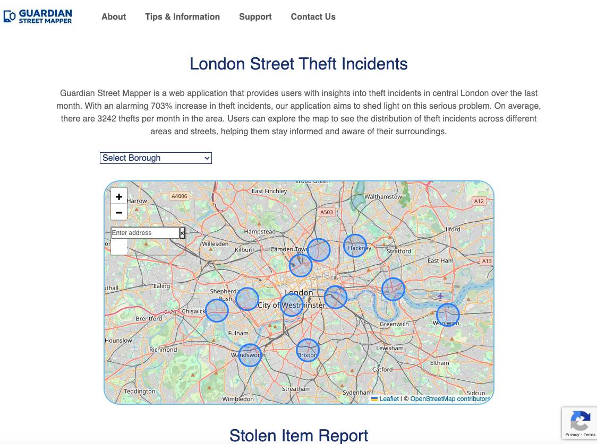

# Guardian Street Mapper

## Description

This team project was structured around building a website called Guardian Street Mapper, which will be used to track the theft rate around different boroughs in London. It will also suggest the nearest police station to the incident. The intention behind this app is to make users aware of the crime rate within the choosen area in order to plan their day to day activities. Visitors to the website can read about other users experience within the area they wish to explore. This app runs in the browser and features Node, Json, Vite, Bootstrap, API and React leaflet.

Furthermore, this website is a front-end interactive webpage which reacts completely to commands, and user input, about any current incident or situation in any chosen area around London.

## Installation

This website is a front-end interactive webpage which reacts completely to user inputs, runs in the browser and features Node, Json, Vite, Bootstrap, API and React leaflet.

- To access the Guardian Street Mapper [follow the link]().
- Open the link on your preferred web browser.
- Explore the website by entering any crime event around the area

## Usage

This app is being developed with the following features:

- **Crime Map**: View an interactive map displaying recent crime incidents in your area.

- **Incident Details**: Access detailed information about each crime incident, including type, location, and time.

- **Report an Incident**: Contribute to community safety by reporting incidents you witness. Include details to help keep others informed.

- **Safety Tips**: Access helpful safety tips and guidelines to stay vigilant and protect yourself.

**How to Use**

- **Set Your Location**: Allow the app to access your location or manually set your preferred locations to receive alerts relevant to your area.

- **Explore the Map**: Navigate the interactive map to see recent crime incidents.

- **Incident Details**: Tap on a marker on the map to view the location of an incident.

- **Report an Incident**: Contribute to community safety by reporting incidents you witness. Provide accurate details for better information sharing.

## Features left to implement:

- Form to feed into map and print on map (attach image if desired).
- Backend built out for global use.
- Map coverage to whole of UK (possibly further).
- Active information sharing with law enforcement.
- Potential development into mobile app.
- Receive push notifications for incidents in your chosen area, on crime types you’re interested in.

## Testing

Comprehensive User Acceptance Testing has been carried out.

## Credits

Collaborators - Please see repository for the team names.

API's used : Police Data API, Leaflet Map API

## License

Commercial License

GuardianStreetMapper Commercial License

This Commercial License ("License") is a legally binding agreement between GuardianStreetMapper ("Licensor") and any individual or entity ("Licensee") who obtains a copy of the software ("Software") licensed under this agreement.

1. Grant of License:
   Licensor hereby grants Licensee a non-exclusive, worldwide, royalty-free license to use, modify, and distribute the Software for commercial purposes, subject to the terms and conditions of this License.

2. Restrictions:
   Licensee shall not sublicense, sell, rent, lease, or otherwise transfer the Software or any rights granted under this License to any third party without prior written consent from Licensor.

3. Proprietary Rights:
   All rights, title, and interest in and to the Software, including all intellectual property rights, are and shall remain the exclusive property of Licensor. Licensee acknowledges and agrees that no ownership or proprietary rights in the Software are transferred under this License.

4. Warranty Disclaimer:
   THE SOFTWARE IS PROVIDED "AS IS", WITHOUT WARRANTY OF ANY KIND, EXPRESS OR IMPLIED, INCLUDING BUT NOT LIMITED TO THE WARRANTIES OF MERCHANTABILITY, FITNESS FOR A PARTICULAR PURPOSE AND NONINFRINGEMENT. IN NO EVENT SHALL THE AUTHORS OR COPYRIGHT HOLDERS BE LIABLE FOR ANY CLAIM, DAMAGES OR OTHER LIABILITY, WHETHER IN AN ACTION OF CONTRACT, TORT OR OTHERWISE, ARISING FROM, OUT OF OR IN CONNECTION WITH THE SOFTWARE OR THE USE OR OTHER DEALINGS IN THE SOFTWARE.

5. Limitation of Liability:
   IN NO EVENT SHALL LICENSOR BE LIABLE FOR ANY DIRECT, INDIRECT, INCIDENTAL, SPECIAL, EXEMPLARY, OR CONSEQUENTIAL DAMAGES (INCLUDING, BUT NOT LIMITED TO, PROCUREMENT OF SUBSTITUTE GOODS OR SERVICES; LOSS OF USE, DATA, OR PROFITS; OR BUSINESS INTERRUPTION) HOWEVER CAUSED AND ON ANY THEORY OF LIABILITY, WHETHER IN CONTRACT, STRICT LIABILITY, OR TORT (INCLUDING NEGLIGENCE OR OTHERWISE) ARISING IN ANY WAY OUT OF THE USE OF THIS SOFTWARE, EVEN IF ADVISED OF THE POSSIBILITY OF SUCH DAMAGE.

6. Governing Law:
   This License shall be governed by and construed in accordance with the laws of Great Britain and Northern Ireland, without regard to its conflict of law principles.

7. Entire Agreement:
   This License constitutes the entire agreement between the parties with respect to the subject matter hereof and supersedes all prior or contemporaneous agreements, whether written or oral, relating to the same subject matter.

By using, modifying, or distributing the Software, Licensee agrees to be bound by the terms and conditions of this License. If Licensee does not agree to these terms, Licensee should not use, modify, or distribute the Software.

Guardian Street Mapper
